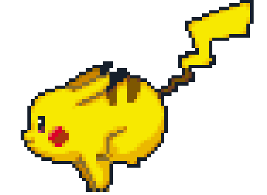
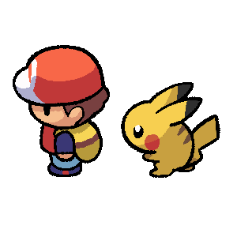
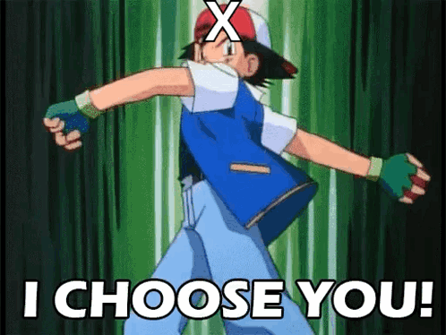

<h3 align="left"><a href="https://github.com/Haus226">
   </a>
</h3>

 <div style="display: flex;">
<!--       -->
     
     
     
     
     
     
     
     
     
     
 </div>

<h1 align="left">
   About Me
   
</h1>




 I'm currently working on [numericAnalysis](https://github.com/Haus226/numericAnalysis)

I'm learning __Numeric Method__, __Matrix Computation__, __Reinforcement Learning__ and __Neural Architecture Search__  

 I like to play Pokemon Games 

How to reach me: osiihy5262@gmail.com 

  I’m looking to collaborate on projects, tech articles and etc... 


<h2> Skills  </h2>


   <table>
   <tr>
      <td align="center" width="96" valign="bottom">
        
        <br>C++
      </td>
      <td align="center" width="96" valign="bottom">
        
        <br>Flutter
      </td>
      <td align="center" width="96" valign="bottom">
        
        <br>Python
      </td>
            <td align="center" width="96" valign="bottom">
        
        <br>C
      </td>
      <td align="center" width="96" valign="bottom">
          
         <br>Pytorch
      </td>
      <td align="center" width="96" valign="bottom">
          
         <br>Tensorflow
      </td>
   </tr>
   <tr>
      <td align="center" width="96" valign="bottom">
       
      <br>Firebase
      </td>
      <td align="center" width="96" valign="bottom">
       
      <br>Unity
      </td>
      <td align="center" width="96" valign="bottom">
       
      <br>Selenium
      </td>
      <td align="center" width="96" valign="bottom">
        
        <br>Git
      </td>
    <td align="center" width="96" valign="bottom">
     
     <br>Scikit
      </td>
      <td align="center" width="96" valign="bottom">
          
         <br>SQLite
      </td>
   </tr>

      
  </table>
</div>

<h2>  Statistics</h2>


<!--START_SECTION:waka-->


**I'm an Early 🐤** 

```text
🌞 Morning                30 commits          ██░░░░░░░░░░░░░░░░░░░░░░░   10.00 % 
🌆 Daytime                145 commits         ████████████░░░░░░░░░░░░░   48.33 % 
🌃 Evening                100 commits         ████████░░░░░░░░░░░░░░░░░   33.33 % 
🌙 Night                  25 commits          ██░░░░░░░░░░░░░░░░░░░░░░░   08.33 % 
```
📅 **I'm Most Productive on Tuesday** 

```text
Monday                   40 commits          ███░░░░░░░░░░░░░░░░░░░░░░   13.33 % 
Tuesday                  68 commits          ██████░░░░░░░░░░░░░░░░░░░   22.67 % 
Wednesday                39 commits          ███░░░░░░░░░░░░░░░░░░░░░░   13.00 % 
Thursday                 38 commits          ███░░░░░░░░░░░░░░░░░░░░░░   12.67 % 
Friday                   36 commits          ███░░░░░░░░░░░░░░░░░░░░░░   12.00 % 
Saturday                 26 commits          ██░░░░░░░░░░░░░░░░░░░░░░░   08.67 % 
Sunday                   53 commits          ████░░░░░░░░░░░░░░░░░░░░░   17.67 % 
```


📊 **This Week I Spent My Time On** 

```text
🕑︎ Time Zone: Asia/Singapore

💬 Programming Languages: 
Python                   13 hrs 51 mins      ██████████████████░░░░░░░   73.39 % 
Dart                     4 hrs 57 mins       ███████░░░░░░░░░░░░░░░░░░   26.23 % 
YAML                     4 mins              ░░░░░░░░░░░░░░░░░░░░░░░░░   00.37 % 
CSV                      0 secs              ░░░░░░░░░░░░░░░░░░░░░░░░░   00.01 % 

🐱‍💻 Projects: 
SnapHealth               18 hrs 53 mins      █████████████████████████   100.00 % 
```

**I Mostly Code in Python** 

```text
Python                   6 repos             ████████████░░░░░░░░░░░░░   46.15 % 
C++                      3 repos             ██████░░░░░░░░░░░░░░░░░░░   23.08 % 
Jupyter Notebook         3 repos             ██████░░░░░░░░░░░░░░░░░░░   23.08 % 
Dart                     1 repo              ██░░░░░░░░░░░░░░░░░░░░░░░   07.69 % 
```


<!--END_SECTION:waka-->


