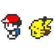
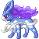

<h3 align="left"><a href="https://github.com/Haus226">
   </a>
</h3>

 <div style="display: flex;">
     
     
     
     
     
     
     
     
     
     
 </div>

<h1 align="left">
   About Me
   
</h1>


 I’m currently working on ___[numericAnalysis](https://github.com/Haus226/numericAnalysis)___

I'm learning __Numeric Method__, __Matrix Computation__, __Reinforcement Learning__ and __Neural Architecture Search__ 

 I like to play Pokemon Games 

How to reach me: osiihy5262@gmail.com 

  I’m looking to collaborate on projects, tech articles and etc... 

  
 

<h2> Skills  </h2>


<div style="display: flex; justify-content: center;">
  <table>

   <td align="center" width="96">
     
     <br>C++
   </td>
   <td align="center" width="96">
     
     <br>Flutter
   </td>
   <td align="center" width="96">
     
     <br>Python
   </td>
         <td align="center" width="96">
     
     <br>C
   </td>


 <td align="center" width="96">
  
  <br>Scikit
   </td>
   <td align="center" width="96">
     
     <br>Git
   </td>
   <td align="center" width="96">
     
     <br>Github
   </td>
         <td align="center" width="96">
       

  </table>
</div>


<h3>🔥 Statistics :</h3>


<!--START_SECTION:waka-->


**🐱 My GitHub Data** 

> 📦 354.7 kB Used in GitHub's Storage 
 > 
> 🏆 106 Contributions in the Year 2024
 > 
> 🚫 Not Opted to Hire
 > 
> 📜 13 Public Repositories 
 > 
> 🔑 1 Private Repositories 
 > 
**I'm an Early 🐤** 

```text
🌞 Morning                23 commits          ███░░░░░░░░░░░░░░░░░░░░░░   10.55 % 
🌆 Daytime                86 commits          ██████████░░░░░░░░░░░░░░░   39.45 % 
🌃 Evening                86 commits          ██████████░░░░░░░░░░░░░░░   39.45 % 
🌙 Night                  23 commits          ███░░░░░░░░░░░░░░░░░░░░░░   10.55 % 
```
📅 **I'm Most Productive on Sunday** 

```text
Monday                   39 commits          ████░░░░░░░░░░░░░░░░░░░░░   17.89 % 
Tuesday                  31 commits          ████░░░░░░░░░░░░░░░░░░░░░   14.22 % 
Wednesday                24 commits          ███░░░░░░░░░░░░░░░░░░░░░░   11.01 % 
Thursday                 31 commits          ████░░░░░░░░░░░░░░░░░░░░░   14.22 % 
Friday                   24 commits          ███░░░░░░░░░░░░░░░░░░░░░░   11.01 % 
Saturday                 24 commits          ███░░░░░░░░░░░░░░░░░░░░░░   11.01 % 
Sunday                   45 commits          █████░░░░░░░░░░░░░░░░░░░░   20.64 % 
```


📊 **This Week I Spent My Time On** 

```text
🕑︎ Time Zone: Asia/Singapore

💬 Programming Languages: 
Python                   9 hrs 54 mins       ████████████████████░░░░░   79.05 % 
Dart                     2 hrs 18 mins       █████░░░░░░░░░░░░░░░░░░░░   18.36 % 
C++                      9 mins              ░░░░░░░░░░░░░░░░░░░░░░░░░   01.24 % 
Markdown                 7 mins              ░░░░░░░░░░░░░░░░░░░░░░░░░   00.94 % 
YAML                     2 mins              ░░░░░░░░░░░░░░░░░░░░░░░░░   00.34 % 

🔥 Editors: 
VS Code                  12 hrs 32 mins      █████████████████████████   100.00 % 

🐱‍💻 Projects: 
numericAnalysis          9 hrs 46 mins       ███████████████████░░░░░░   77.93 % 
SudokuSolver             1 hr 57 mins        ████░░░░░░░░░░░░░░░░░░░░░   15.68 % 
sudoku_solver            23 mins             █░░░░░░░░░░░░░░░░░░░░░░░░   03.17 % 
SnapHealth               23 mins             █░░░░░░░░░░░░░░░░░░░░░░░░   03.15 % 
Unknown Project          0 secs              ░░░░░░░░░░░░░░░░░░░░░░░░░   00.07 % 

💻 Operating System: 
Windows                  12 hrs 32 mins      █████████████████████████   100.00 % 
```

**I Mostly Code in Python** 

```text
Python                   5 repos             ██████████░░░░░░░░░░░░░░░   41.67 % 
C++                      3 repos             ██████░░░░░░░░░░░░░░░░░░░   25.00 % 
Jupyter Notebook         3 repos             ██████░░░░░░░░░░░░░░░░░░░   25.00 % 
Dart                     1 repo              ██░░░░░░░░░░░░░░░░░░░░░░░   08.33 % 
```


**Timeline**


 Last Updated on 11/03/2024 15:23:53 UTC
<!--END_SECTION:waka-->


